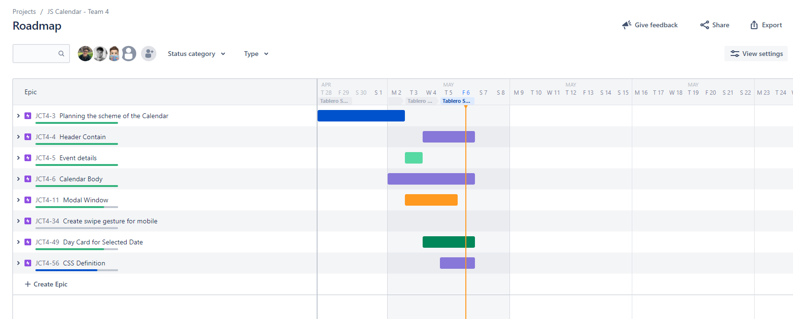

# 📅 JS Calendar Events

## About The Project

Simple, lightweight, stylish calendar + organizer JavaScript Library.\
This project consists of a calendar using the main web fundamentals.\
This calendar allows users to create events and and add reminders up to an hour before.

## Roadmap




## 🔨 Basic Usage

1. Navigate within months and years

## 📓 Doc

### Calendar Object

The calendar object used to display days and navigate within months and years.

```javascript
const calendar = (year) => {
  let calendarMonth = [];
  numberOfMonths.map((numberOfMonth, index) => {
    const date = new Date(year);
    let intl = new Intl.DateTimeFormat(locale, {
      month: "long",
    });

    let nameOfMonths = intl.format(new Date(year, numberOfMonth));
    let numbersOfDays = new Date(year, numberOfMonth + 1, 0).getDate();
    let days = [];

    for (let i = 1; i <= numbersOfDays; i++) {
      days.push({
        number: i,
        events: [],
      });
    }
    calendarMonth.push({
      year: year,
      nameOfMonth: nameOfMonths,
      numbersOfDays: numbersOfDays,
      days: days,
    });
  });

  if (!localStorage.getItem(`data-${year}`)) {
    localStorage.setItem(`data-${year}`, JSON.stringify(calendarMonth));
  }

  return calendarMonth;
};
```

### Build calendar

```javascript
const buildCalendar = (calendar, year, numberOfMonths) => {
  calendar.forEach((month) => {
    let monthElement = document.createElement("div");
    let monthName = document.createElement("h2");
    let daysContainer = document.createElement("div");
    const containerCalendar = document.getElementById("mainCalendar");

    daysContainer.classList.add("days__container");
    monthElement.classList.add("calendar");
    monthElement.classList.add("hide");
    monthElement.setAttribute("data-month", month.nameOfMonth);
    monthElement.setAttribute("year", month.year);
    monthName.textContent = `${month.nameOfMonth.toUpperCase()} ${month.year}`;

    monthElement.appendChild(monthName);
    monthElement.appendChild(daysContainer);
    getWeeksDays(daysContainer, locale);
    setDays2(daysContainer, month.numbersOfDays, year);

    containerCalendar.appendChild(monthElement);
  });
  getFirstDayOfMonth(year, numberOfMonths);
};
```

### Events Class

```javascript
export class Event {

    constructor(title, description, initDate, existsEndDate, endDate, reminder, reminderTime, type) {
        this.title = title;
        this.description = description;
        this.initDate = initDate;
        this.endDate = !existsEndDate ? null : endDate;
        this.reminder = reminder;
        this.reminderTime = reminderTime;
        this.type = type;
        this.finnished = false;
    }

    setFinnished(value) {
        this.finnished = value;
    }

    createEventMessage() {
        return `${this.title} has been succesfully added to your calendar.`;
    }

    removeEventMessage() {
        return `${this.title} has been succesfully removed from your calendar`;
    }

    checkRequiredInputs() {
        if (this.title == "" || this.title == null) {
            return true;
        } 
    }

    //Less than 60 characters
    checkTitle(num) {
        if (num > 60) {
            return true;
        }
    }

    //Init date is in the current month
    checkInitDate() {
        if (((new Date()).getMonth() !== this.initDate.getMonth()) || new Date() >= this.initDate) {
            return true;
        }
    }

    //End date is greater than init date
    checkEndDate() {
        if (this.initDate.getTime() > this.endDate.getTime()) {
            return true;
        }
    }

    checkReminder() {
        if(this.reminder && this.reminderTime == "") {
            return true;
        }
    }

    requiredMessages(name) {
        return `${name} field is required.`
    }

    errorMessages(name) {
        switch (name) {
            case "title":
                return 'Title max lenght is 60 characters.';
            case "initDate":
                return 'Initial date must be in the current month or greater than the current day.';
            case "endDate":
                return 'End date must be greater than initial date.';
            case "reminder":
                return 'You must select a reminder time.';
            default:
                break;
        }
    }

}
```
🖼️ Screenshots

![test image size]


## 🚀 About Us
We are three motivated and passionate web developpers currently studying at Assembler Institute of Technology

## 🔗 Links
[Jesús Herrera](https://github.com/Jesusjha)\
[Alejandro Ávila](https://github.com/alejandroaperez1994g)\
[Alicia Cembranos](https://github.com/alicembranos)

## Demo

Insert gif or link to demo
