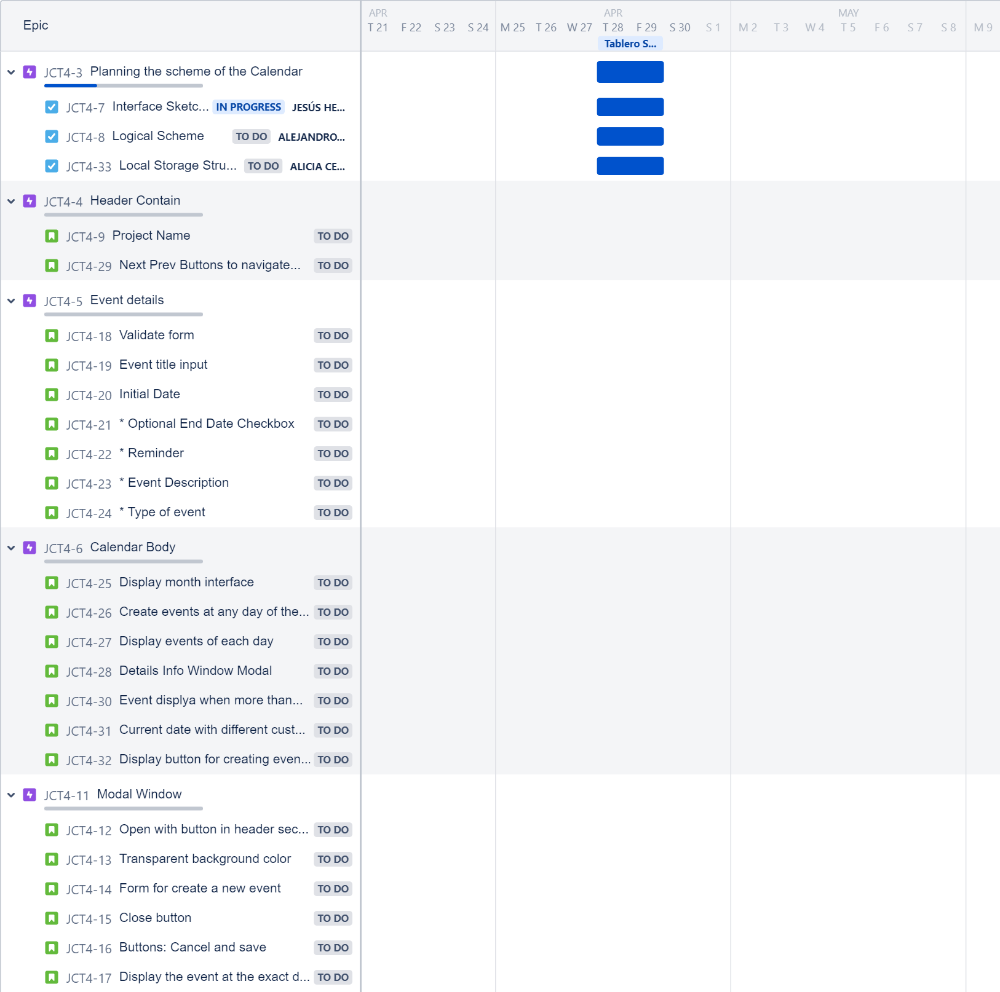
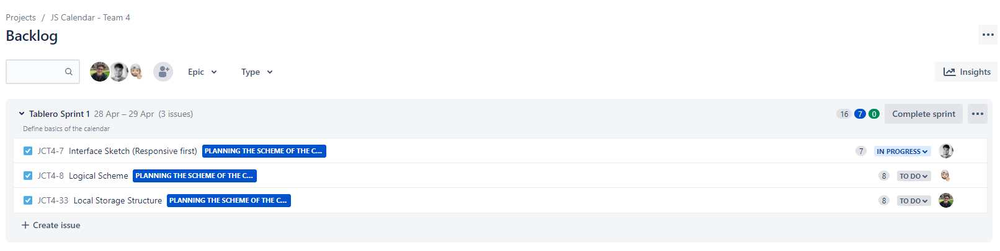

# JS CALENDAR TEAM 4

## 28th April 

### PARTICIPANTS 

* Jesús Herrera
* Alejandro Ávila
* Alicia Cembranos

### DONE

* Define the roadmap (product backlog -- features)

* Assign story points to each task and launch Sprint 1

* Define the layout as base for building UI Structure

#### PERFORMED AND IN PROCESS TASKS BY TEAM MEMBER

#### TO DO IN NEXT SESSION

* Complete sprint 1

        *Finish the definition of UI layout*
        *Structure the logical part*
        *Define how to store data in the local storage*

## 29th April 

### PARTICIPANTS 

* Jesús Herrera
* Alejandro Ávila
* Alicia Cembranos

### DONE

* Created the Interface Sketch (Responsive first)

##### Computer Screen Interface

##### Window Modal Interface

##### Mobile Screen Interface

* Think about the way to store in the local storage 
* Create the HTML file defining class and ids
* Define the CSS layout for the main content.
* Stablish the base of the logical part (Javascript)

#### PERFORMED AND IN PROCESS TASKS BY TEAM MEMBER

#### TO DO IN NEXT SESSION

* Finnish modal windows CSS basics
* Calendar Display

        *Generate Calendar*
        *Display Calendar*
        
        