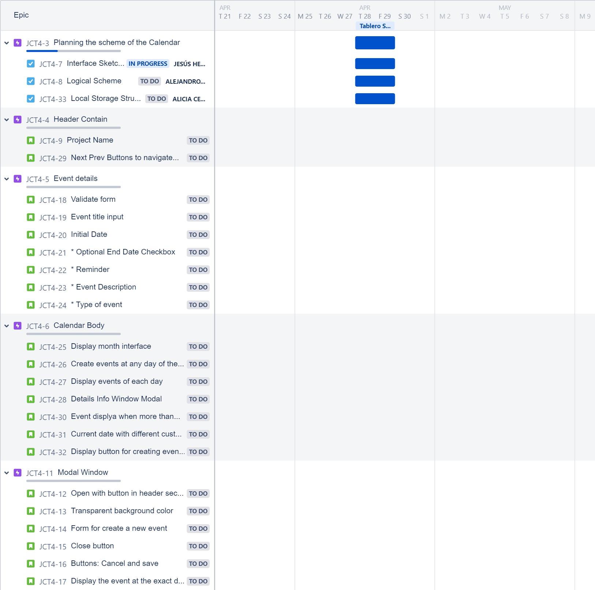

# JS CALENDAR TEAM 4

## ROADMAP

## 28th April 

### PARTICIPANTS 

* Jesús Herrera
* Alejandro Ávila
* Alicia Cembranos

### DONE

* Define the roadmap (product backlog -- features)

* Assign story points to each task and launch Sprint 1

* Define the layout as base for building UI Structure

#### PERFORMED AND IN PROCESS TASKS BY TEAM MEMBER

#### TO DO IN NEXT SESSION

* Complete sprint 1

        *Finish the definition of UI layout*
        *Structure the logical part*
        *Define how to store data in the local storage*

## 29th April 

### PARTICIPANTS 

* Jesús Herrera
* Alejandro Ávila
* Alicia Cembranos

### DONE

* Created the Interface Sketch (Responsive first)

##### Computer Screen Interface

##### Window Modal Interface

##### Mobile Screen Interface

* Think about the way to store in the local storage 
* Create the HTML file defining class and ids
* Define the CSS layout for the main content.
* Stablish the base of the logical part (Javascript)

#### PERFORMED AND IN PROCESS TASKS BY TEAM MEMBER

#### TO DO IN NEXT SESSION

* Finnish modal windows CSS basics
* Calendar Display

        *Generate Calendar*
        *Display Calendar*

## 2nd May 

### PARTICIPANTS 

* Jesús Herrera
* Alejandro Ávila
* Alicia Cembranos

### DONE

* Create calendar function
* Create events at any day of the month (Modal Window)
* Display or render calendar
* Event Listener Open Form for each Day
* Display button for creating events
* Create Cell for each day (Clone from template)

### DIFFICULTIES

* How to storage the events in the localstorage ?
* Upload events taking the array from the localstorage to a local array or functions to loop all over the year and add events to each day looking in the array taked from the localstorage?
* First logical part was really good but we found problems trying to connect with the second part.

#### PERFORMED AND IN PROCESS TASKS BY TEAM MEMBER

#### TO DO IN NEXT SESSION

* Create the logical of the local storage
* Display events of each day
* Add event listeners to all reminders
* Event Form Validation (event class)
* Current date with different custom style

## 3st May 

### PARTICIPANTS 

* Jesús Herrera
* Alejandro Ávila
* Alicia Cembranos

### DONE

* Create the logical of the local storage
* Save and upload events
* Display events of each day
* Event Form Validation (event class) (Sprint 3)
* Event Class (Sprint 3)

### DIFFICULTIES

* We faced some difficulties with dates in JS and to understand the different between UTC ISO string formats.

#### LESSONS LEARNED

* The getTimezoneOffset() method returns the difference, in minutes, between a date as evaluated in the UTC time zone, and the same date as evaluated in the local time zone.

#### PERFORMED AND IN PROCESS TASKS BY TEAM MEMBER

#### TO DO IN NEXT SESSION

* Function render day card
* Reminder for warning message
* Info modal for event info

## 4th May 

### PARTICIPANTS 

* Jesús Herrera
* Alejandro Ávila
* Alicia Cembranos

### DONE

* Check if an event is done or completed
* Insert Next Prev Buttons to navigate within months
* Display the current date in the header day card
* Display list of events of the current date (must be modified the next day)
* Implement function to add event listener to each list item and display modal info window

### DIFFICULTIES

* Problems with setting reminder of each event. WE decided to use setTimeout and calculate the differentce between current date and initial date or initial date - reminder time to launch the event reminder but it's not working yet.
* We needed to modify the arguments of create list event function to be able to control if an event is finnished or done.

#### LESSONS LEARNED

* How to calculate time between dates.

#### PERFORMED AND IN PROCESS TASKS BY TEAM MEMBER

#### TO DO IN NEXT SESSION

* Make reminder function work 
* Display mini calendar in aside section
* Navigate between years and generate localstorage for each year
* Apply CSS to the calendar
* Display background by event
* Do the function to order events by date in de displayed list
* Give header to the project 

## 5th May 

### PARTICIPANTS 

* Jesús Herrera
* Alejandro Ávila
* Alicia Cembranos

### DONE

* Make reminder function work 
* Display mini calendar in aside section
* Navigate between years and generate localstorage for each year
* Apply CSS to the calendar
* Display background by event
* Do the function to order events by date in de displayed list
* Give header to the project 

### DIFFICULTIES

* we faced a lot of problems displaying the minicalendar and add the functionality to switch between years to it. Finally we had to modify the numberOfMonths because it was set with the value of 12 and this made the functionality doesn't work properly.
* The create event list function was modified in the previous sprint and beacause of this the logical of the eventlistener give to the day number in th calendar must been fixed.

#### LESSONS LEARNED

* The recursion method to navigate within the DOM.
* The childElementCount property.
* Give and interval ID property to the event to know what setTimeout we have to clear.

#### PERFORMED AND IN PROCESS TASKS BY TEAM MEMBER

#### TASK NOT FINNISHED

        
